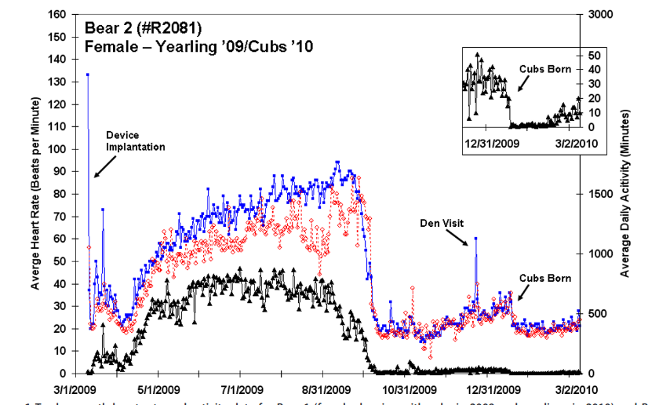
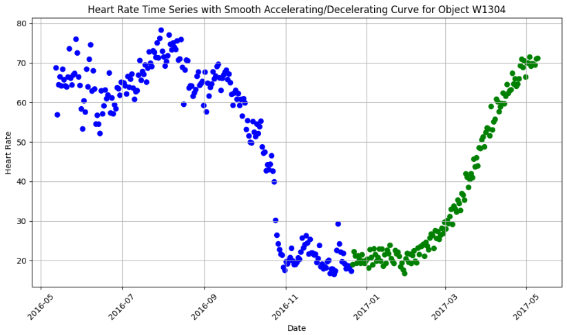
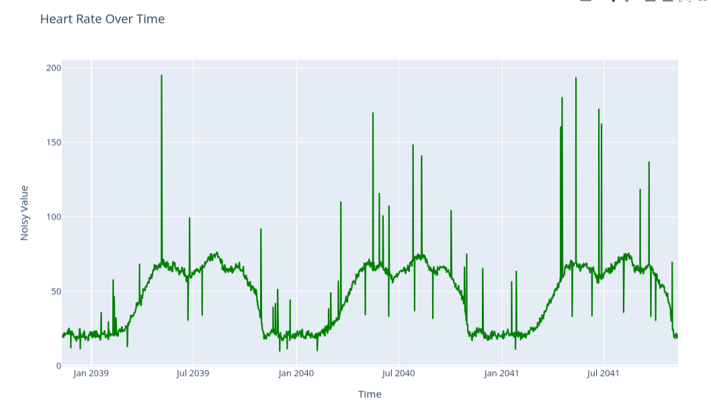
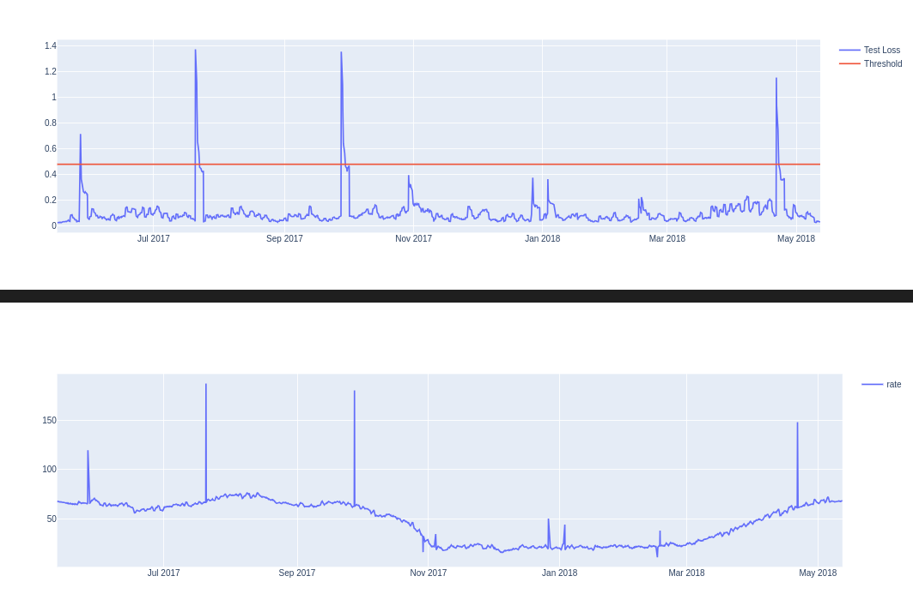

# Anomaly Detection Case: Cobblestone

## Show Me the Demo

1. **Clone the Repository:**
   ```bash
   git clone <link>
   ```

2. **Navigate to the Working Directory:**
   ```bash
   cd anomaly_case
   ```

3. **Run the Project:**
   ```bash
   make run
   ```
   This will start containers for data population and anomaly detection. The dashboard will be available at `http://localhost:5006/dashboard`. It may take up to 2 minutes to display detected anomalies. To see changes in data refresh the page.

## Data Simulation

### What Is Our Data?

I aimed to work with a different dataset than classical seasonal data like Wi-Fi sessions or yearly sales. I chose bear activity data due to their hibernation patterns, which could reveal interesting insights.

I discovered a [research article](https://www.nature.com/articles/srep40732) on the effects of human interaction on bears' stress levels and used it as inspiration. My virtual motivation was to create data to detect sudden changes in an endangered animal's activity and alert authorities for protection.



### Generating the Data

I found an incomplete [yearly hibernation dataset](https://datadryad.org/stash/dataset/doi:10.5061/dryad.6tt0h5s). To complete it, I extended the data by following the trend of initial hibernation. I added white noise to maintain the original entropy and generated the remaining data. The generated data is shown in green.



After generating the data for one season, I smoothed it using a windowed mean. I added white noise for natural deviations and occasional large values to simulate anomalies. An example of the data stream is shown below. 



# Anomaly Detection

I have decided to go with auto-encoding to implement anomaly detection in this project. In simple terms, our model tries to reconstruct the data we provided in training. And the loss is how far is newly introduced data from the guess of our model. If loss is larger than a certain threshold (setup manually since we only have non-anomaly data for training). Below you can see effectiveness of loss-threshold model in detecting introduced anomalies. First graph shows the loss vs threshold  during time. The second graph shows, introduced anomalies in generated data.

