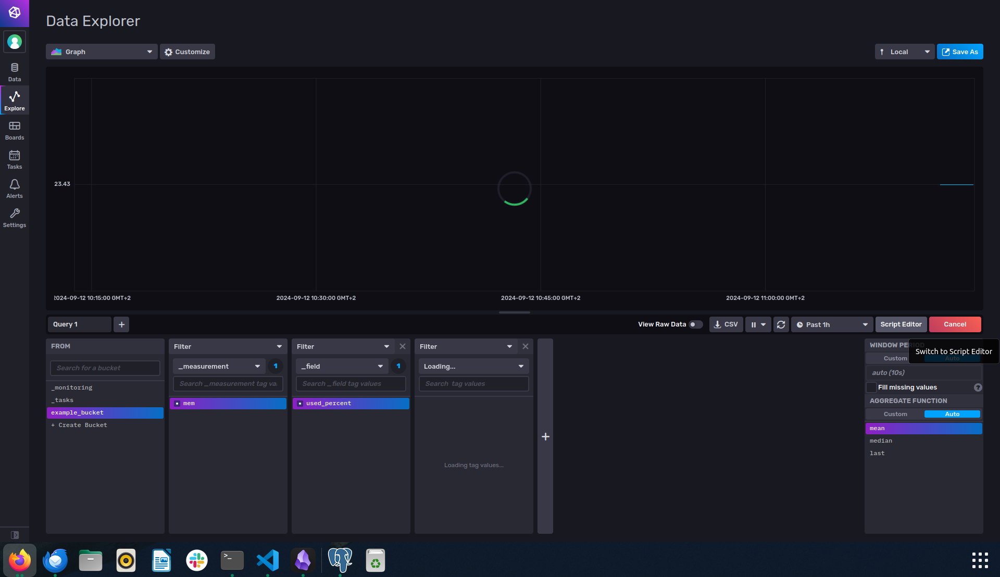

# How to run?

just run `make run` on working directory. Influxdb (timeseries database) will be running in a container, and will be exposed on port `8086`.

You can check if it is running by going `http://localhost:8086`. Username and password information is in `.env` file.

# How to add data?
influxdb provides ready to run code in its ui. I have copied it to `data_simulator.py`. So you can just run that python code. No need to run in docker.

After running it, it will add data every 5 seconds. You can observe it in the UI:

